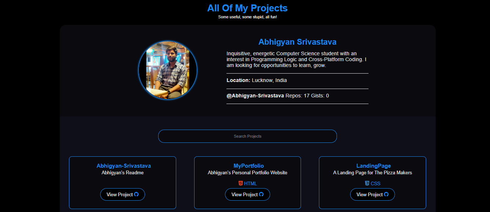

<h1>Projects</a></h1>

<h3>Showcase all your projects!!</h3>

## Introducing Projects
Present all your projects in style with a super customizable web app! ✨

`Projects` uses the GitHub API to list all your GitHub projects in a nice searchable grid.
Also shows pretty programming icons using `devicons`.

## Screenshot

<figure>
  
</figure>

## Demo

https://abhigyan-srivastava.github.io/projects/

## Author

- [@Abhigyan-Srivastava](https://github.com/Abhigyan-Srivastava)